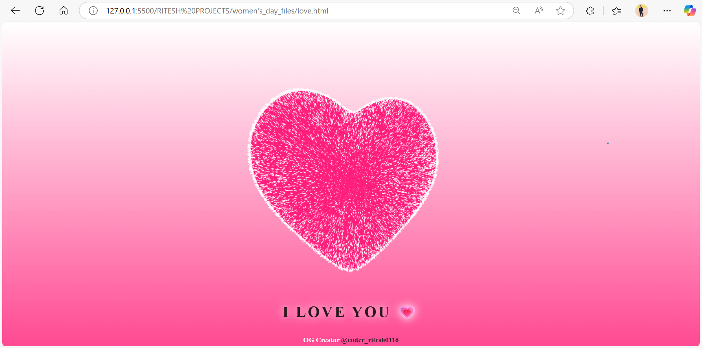

**# 💖 Women’s Day Surprise Website 🚀**
*A 3D Love Experience for Her*  

---

## 📸 Website Homepage

---

## 🌐 Live Demo

[- 🔗 Click here to view the live site on Netlify](https://womensdayspecial.netlify.app/)

[- 🔗 Click here to view the live site on GitHub Pages](https://riteshraut0116.github.io/ganpati_bappa_html/)

---

## 🌟 Story Behind the Code  
I built this interactive website to surprise my girlfriend on **Women’s Day**! It features a hidden 3D rotating heart, custom cursor animations, and a heartfelt message. When she clicks "OPEN", the love page reveals a **360° interactive heart** with "I LOVE YOU" text. Perfect for coders who want to romance their partners uniquely!  

---

## 🛠️ Features  
- **3D Rotating Heart**: Draggable & interactive using Three.js.  
- **Custom Cursor Animation**: Smooth "clicklove.js" effect.  
- **Responsive Design**: Works on mobile & desktop.  
- **Hidden Surprise Page**: Click "OPEN" to reveal the love message.  
- **SEO-Friendly**: Built for virality (Instagram-ready!).  

---

## 🚀 Tech Stack  
- **Frontend**: HTML5, CSS3, JavaScript  
- **3D Animation**: Three.js  
- **Cursor Effects**: Custom JavaScript (clicklove.js)  
- **Hosting**: GitHub Pages / Netlify / Vercel  

---

## ⚡ Quick Start  
1. **Clone the repo**:  

---

## 🌈 Customize for Your Partner  
1. **Replace text** in `index.html` (line 42) with your message.  
2. **Tweak heart colors** in `styles.css` (search for `--heart-color` variable).  
3. **Add your own photos/videos** to the `img/` folder. 

---

## 🤝 Contributing  
Feel free to fork and customize!  
- Add more animations (e.g., floating particles).  
- Implement a love letter slider.  
- Add music on button click.  
- **Tag me on Insta** if you create a version – I’ll feature it!  

---

## 💌 Acknowledgments  
- Inspired by my amazing girlfriend ❤️  
- Three.js community for 3D magic.  
- You – for spreading love through code!  

---

## 📄 License  
MIT License – *Code with love, share with the world!*  

---

## 👤 Author

**Ritesh Raut**  
*Programmer Analyst, Cognizant*

---

### 🌐 Connect with me:

---